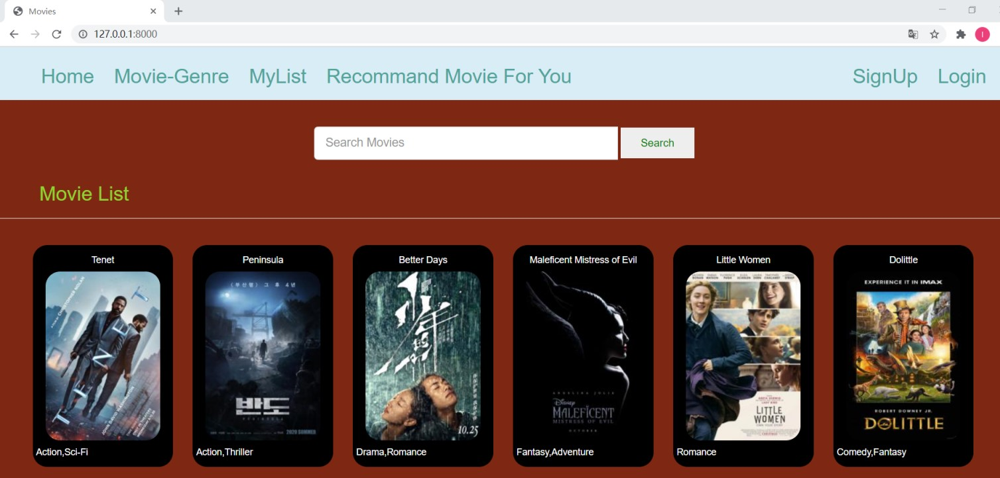

## SECTION 1 : PROJECT TITLE
## Movie Recommend System

     
     
## SECTION 2 : EXECUTIVE SUMMARY / PAPER ABSTRACT
With the rapid development of the film industry, all kinds of films on the platform have expanded and increased exponentially. In such a huge movie database, it is very difficult for moviegoers to decide which movie to watch. Recommendation systems are widely used in the Internet industry, with personalized recommendations for takeaway apps, shopping apps, etc. In order to save the time for moviegoers to investigate and analyze the huge number of movies, we built this movie recommendation system. This system will recommend a list of movies suitable for watching based on the preferences of the moviegoers.

Our group consists of four students who love movies and  we usually watch movies in our leisure time. However, the current personalized recommendation function of video apps is not very complete. Most of the recommendations are based on the general data of the movie market, and there is no personalized recommendation. So we want to complete a personalized movie recommendation system, which can recommend a movie list according to each user’s own preferences

In order to implement this system, we first built a database containing the detailed content of each movie. The data comes from open source movie data on the Internet. Then we use Python to build the front-end UI and back-end data processing system, and connect them. Finally, it can be visited for experience through an independent URL.

We believe that this system has great commercial value. Movies are the most popular leisure activity for people nowadays. Nowadays, there are many movies on the market, and people don't know how to choose a movie that suits them. Through such a recommendation system, it saves the time for viewers to investigate and also allows them to see movies that suit their tastes.

## SECTION 3 : CREDITS / PROJECT CONTRIBUTION

| Official Full Name  | Student ID (MTech Applicable)  | Work Items (Who Did What) | Email (Optional) |
| :------------ |:---------------:| :-----| :-----|
| Wang Sixiang | A0215475A | 1. System architecture design 2. Django backend development 3. Implementation of front end and back end interaction 4. Project report writing | e0535565@u.nus.edu |
| Cao Zihao | A0215407M | 1. Data Acquisition 2. Data Processing 3. SQLite Database development 4. Project report writing| e0535497@u.nus.edu |
| Liu Yanjie | A0215270R | 1. Django backend development 2. Algorithm design and Implementation 3. Implementation of front end and back end interaction 4. Project report writing | e0535360@u.nus.edu |
| Chen Tianyu | A0215260U | 1. User interface development 2. Project report writing | e0535350@u.nus.edu |

## SECTION 4 : VIDEO OF SYSTEM MODELLING & USE CASE DEMO
[![]](https://www.youtube.com/watch?v=pJIyrnQgGe0&feature=youtu.be "")

## SECTION 5 : USER GUIDE
## Installation:
>pip install -r requirements.txt
#### Run server locally(cmd):
$ python manage.py runserver
Then go to localhost:8000
http://127.0.0.1:8000/

## SECTION 6 : PROJECT REPORT / PAPER
`Refer to project report at Github Folder: ProjectReport`
- Executive Summary
- Problem Description
- Knowledge Modelling
- Solution Outline
- Conclusion & Refrence
- Reference
- Appendix of report:Project Proposal
- Appendix of report:Installation & User Guide
- Appendix of report:1-2 pages individual project report per project member

**This [Machine Reasoning (MR)](https://www.iss.nus.edu.sg/executive-education/course/detail/machine-reasoning "Machine Reasoning") course is part of the Analytics and Intelligent Systems and Graduate Certificate in [Intelligent Reasoning Systems (IRS)](https://www.iss.nus.edu.sg/stackable-certificate-programmes/intelligent-systems "Intelligent Reasoning Systems") series offered by [NUS-ISS](https://www.iss.nus.edu.sg "Institute of Systems Science, National University of Singapore").**

**Lecturer: [GU Zhan (Sam)](https://www.iss.nus.edu.sg/about-us/staff/detail/201/GU%20Zhan "GU Zhan (Sam)")**

**zhan.gu@nus.edu.sg**
